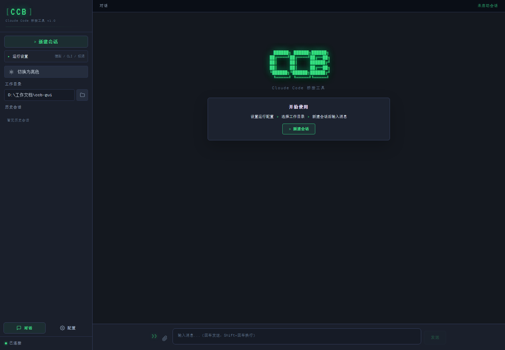

# CCB GUI

一个为 [Claude Code](https://github.com/anthropics/claude-code)（`claude` / `ccb`）打造的轻量级 Web 前端。无需安装任何第三方框架，纯 Python 标准库驱动，启动即用。



---

## 功能特性

- **流式对话** — 通过 SSE（Server-Sent Events）实时展示 AI 输出，无需轮询
- **多会话管理** — 侧边栏列出历史会话，随时切换或新建
- **文件附件** — 内置目录浏览器，默认打开当前工作目录，支持多选文件直接注入上下文
- **工作目录切换** — 每条消息可指定独立的 CWD，工具调用在对应目录下执行
- **模型切换** — 下拉菜单选择模型，或自定义模型 ID
- **CLI 自动检测** — 自动发现本地 `ccb.exe`、PATH 中的 `ccb` 与 `claude`
- **Markdown 渲染** — 代码块语法高亮，工具调用折叠展示
- **深色主题** — VS Code Dark+ 风格配色，长时间使用不疲眼

---

## 快速开始

### 前置条件

- Python 3.10+
- 已安装并可用的 `claude` 或 `ccb` CLI

### 启动

**Windows（推荐）**

```bat
start.bat
```

**跨平台**

```bash
python server.py
```

服务启动后会打印监听地址（随机端口），用浏览器打开即可。

---

## 目录结构

```
cc-gui/
├── ccb.exe              # 可选：本地 ccb 可执行文件
├── server.py            # HTTP 服务器（纯标准库，asyncio）
├── ccb_bridge.py        # ccb/claude 子进程管理与流式通信
├── config_manager.py    # 配置与环境变量读写
├── session_store.py     # 会话历史持久化
├── start.bat            # Windows 一键启动脚本
├── static/
│   ├── index.html       # 页面结构
│   ├── app.js           # 前端逻辑
│   └── style.css        # 主题样式
└── README.md
```

---

## API 概览

服务器暴露以下 HTTP 端点：

| 方法 | 路径 | 说明 |
|------|------|------|
| GET | `/` | 主页面 |
| GET | `/api/sse?client_id=…` | SSE 事件流 |
| POST | `/api/chat` | 发送消息（支持文件附件） |
| POST | `/api/stop` | 中断当前生成 |
| POST | `/api/browse-directory` | 浏览目录（仅子目录） |
| POST | `/api/browse-files` | 浏览目录（文件+子目录） |
| GET | `/api/sessions` | 列出所有会话 |
| POST | `/api/sessions/load` | 加载历史会话 |
| DELETE | `/api/sessions/:id` | 删除会话 |
| POST | `/api/settings` | 读写设置 |
| GET | `/api/available-clis` | 检测可用 CLI |

---

## 技术说明

- **零依赖服务端**：HTTP、SSE、multipart 解析全部手写，不依赖 Flask / FastAPI 等框架
- **SSE 替代 WebSocket**：规避 Windows asyncio 的 WebSocket 兼容性问题
- **子进程通信**：每条消息启动一个 `ccb -p --stream-json` 子进程，`--resume` 实现多轮连续对话
- **文件安全**：`/api/file` 预览端点仅允许访问 `.gui-uploads/` 目录下的文件，防止路径穿越

---

## License

MIT
